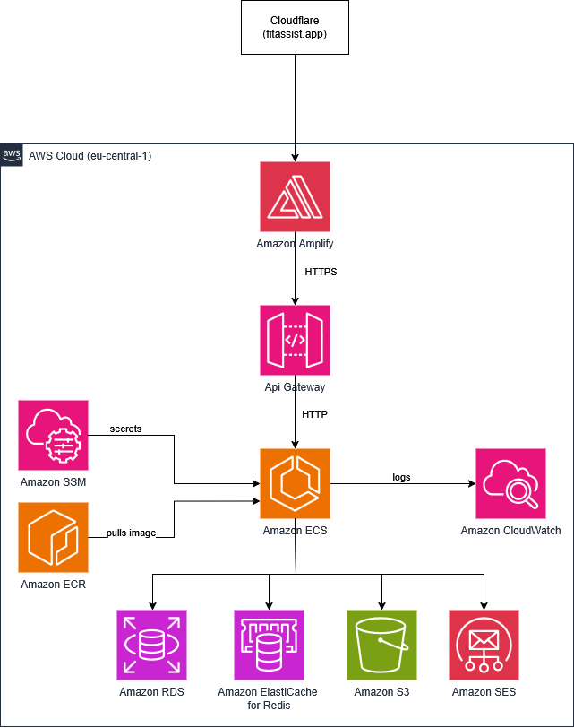
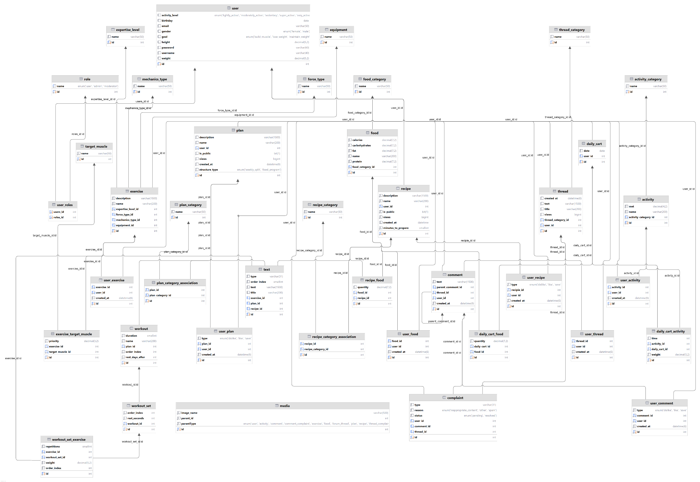

# Fitassist Backend

> Licensed under [Business Source License 1.1](LICENSE). Free for non-commercial use. For commercial licensing contact ladnyiartem@gmail.com.

## About

Fitassist is a unified fitness web application that eliminates the need to switch between multiple platforms by combining calorie tracking, activity tracking, workout planning, recipe management, and a community forum into a single platform. This repository contains the server-side application.

The backend is a monolithic REST API built with Spring Boot 4 and Java 25, backed by MySQL on Amazon RDS, a two-level cache (Caffeine L1 + Redis L2 on ElastiCache), full-text search via Apache Lucene, media storage on Amazon S3, and email delivery via Amazon SES. The frontend is maintained in a separate repository.

**Tech Stack:** Spring Boot 4.0.3 | Java 25 | MySQL 8.0 | Redis | Apache Lucene | AWS (RDS, ElastiCache, ECS, ECR, S3, SES) | Docker | Testcontainers

**Test Coverage:** 81% overall (JaCoCo) · 100% controller integration test coverage via Testcontainers

**Live:** [fitassist.app](https://fitassist.app)

**API Documentation:** [Postman Docs](https://documenter.getpostman.com/view/34870574/2sBXcGEf3L)

---

## Features

| Domain | Capabilities |
|---|---|
| User management | Registration, login, JWT auth, password reset, profile management |
| Food tracking | Food database (1370 items), macro calculation, daily food diary |
| Activity tracking | Activity database (1114 items), calorie expenditure calculation, daily activity log |
| Exercise library | Exercise database (873 items), step-by-step instructions, muscle targeting |
| Workout plans | User-created plans with structured workout days, sets, exercises |
| Recipes | User-created recipes with ingredients, macros, instructions |
| Daily diary | Per-day food and activity log with calorie and macro summaries |
| Analytics | Periodic reports, heatmap, calorie and macro charts |
| Forum | Threaded discussions with comments, likes, saves |
| Search | Full-text global search across all content types (Lucene, fuzzy, prefix) |
| Admin | Content management, category management, complaint resolution |
| Media | Image uploads per entity via Amazon S3 |

---

## API Documentation

Full API reference with request/response examples is available on Postman:

[https://documenter.getpostman.com/view/34870574/2sBXcGEf3L](https://documenter.getpostman.com/view/34870574/2sBXcGEf3L)

Base URLs:
- Production: `https://api.fitassist.app`
- Development: `http://localhost:8000`

Authentication uses cookie-based JWT. Login via `POST /api/users/login` — the server sets `accessToken` and `refreshToken` as HTTP-only cookies automatically.

---

## Usage

### Installation

```bash
git clone <repository-url>
cd FitassistBackend
docker-compose up -d
./gradlew build
```

### Commands

| Command | Description |
|---|---|
| `./gradlew bootRun` | Run the application |
| `./gradlew test` | Run all tests |
| `./gradlew build` | Build the project |
| `./gradlew jib` | Build and push Docker image to ECR |
| `./gradlew checkFormat` | Check code formatting |
| `./gradlew format` | Auto-fix formatting |

---

## Development

### Prerequisites

- Java 25
- Docker
- MySQL 8.0 (or use Docker Compose)
- Redis (or use Docker Compose)

### Environment Setup

Create `.env.properties` in the project root:

```properties
SPRING_PROFILES_ACTIVE=dev
JWT_SECRET_KEY=your-secret-key
```

Start dependencies:

```bash
docker-compose up -d
```

Run the application:

```bash
./gradlew bootRun
```

### File Structure

```
src/main/java/com/fitassist/backend/
├── auth/           # JWT, filters, cookie service, rate limiting
├── config/         # Spring Security, CORS, cache, AWS configuration
├── controller/     # REST controllers
├── dto/            # Request/Response DTOs
├── mapper/         # MapStruct mappers
├── model/          # JPA entities
├── repository/     # Spring Data repositories
├── service/        # Business logic
└── validation/     # Custom validators
```

### Testing

```bash
./gradlew test
```

Coverage reports are generated at `build/jacocoHtml/index.html`.

Tests use Testcontainers for integration tests — Docker must be running.

### Deployment

Deployed to AWS ECS via GitHub Actions CI/CD pipeline. Infrastructure: ECS, ECR, RDS (MySQL), ElastiCache (Redis), S3, SES.

```bash
./gradlew jib  # Build and push Docker image to ECR
```

---

## Architecture

### C4 Diagram — Level 3 (Components)


### Deployment Diagram



### Data Model (ERD)



### Security

- **Authentication:** Stateless JWT via HTTP-only cookies (`accessToken` 15 min, `refreshToken` 7 days)
- **CSRF:** Cookie-based CSRF protection (`XSRF-TOKEN` / `X-XSRF-TOKEN`)
- **CORS:** Restricted to authorized frontend origins
- **Rate limiting:** Redis-backed (Redisson) — per user ID for authenticated endpoints, per anonymous UUID for public endpoints
- **Password hashing:** BCrypt

### Caching

Two-level composite cache:
- **L1 — Caffeine** (in-memory, 5000 entries, 2 min TTL) — ultra-fast local cache
- **L2 — Redis on ElastiCache** (15 min TTL) — shared distributed cache

### Search

Full-text search powered by Apache Lucene. Supports fuzzy matching (up to 2 spelling errors) and prefix search across all content types.

### Data Sources

| Database | Records | Source |
|---|---|---|
| Exercises | 873 | [Free Exercise DB](https://github.com/yuhonas/free-exercise-db) |
| Foods | 1370 | [FRIDA Food Database](https://frida.fooddata.dk) — National Food Institute, DTU |
| Activities | 1114 | 2024 Adult Compendium of Physical Activities |

---

## Community

### Contribution

1. Fork the repository
2. Create a feature branch off `dev`
3. Make your changes
4. Run `./gradlew checkFormat` and `./gradlew test`
5. Submit a pull request to `dev`

### Branches

| Branch | Purpose |
|---|---|
| `master` | Production |
| `dev` | Development |

### Guidelines

- Follow [Spring Java Format](https://github.com/spring-io/spring-javaformat)
- Write tests for new features
- Keep commits focused and descriptive
